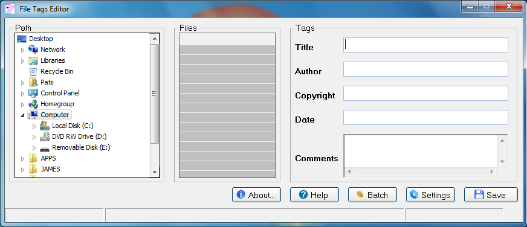
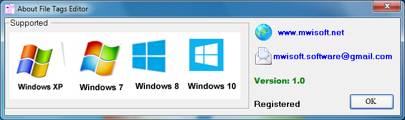
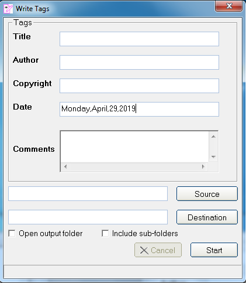
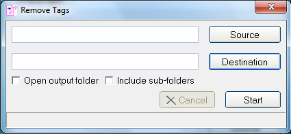

# File Tags Editor  ```version 1.0```

## About the File Tags Editor

****
File Tags Editor is a tool for writing, viewing and editing tags. Not all  file formats support writing of meta-information.
This user-friendly tool will enable you to write, view and edit common file tags. It's possible to process multiple files at once.
Drag and drop method of loading multiple files at once is also supported.
The main window of the program is split into three parts: the left part shows the path of the folder while the centre part shows the loaded files and the right part is where the user of the program can write, view and edit file tags.
The program has been designed to be used by both novice and experienced computer users.
### System Requirements
****
```Windows 10, Windows 8.1, Windows 8, Windows 7, Windows xp
```



### How to write
****


### How to Remove
****


### Official Website :

Web: http://www.mwisoft.net

### Email :
software@gmail.com

### Buy :

Buy: http://sites.fastspring.com/mwisoft/product/filetagseditor

### Download free

 http://www.mwisoft.net/File_Tags_Editor.zip
